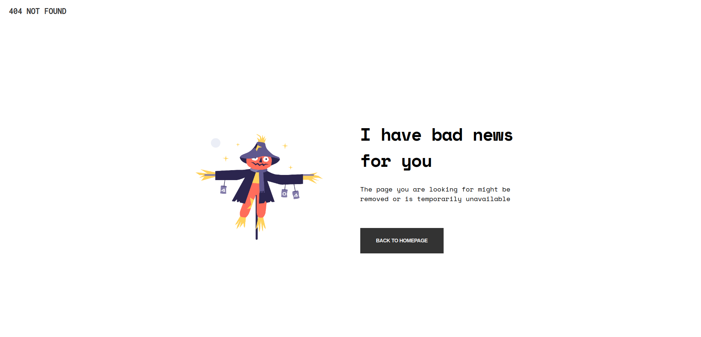
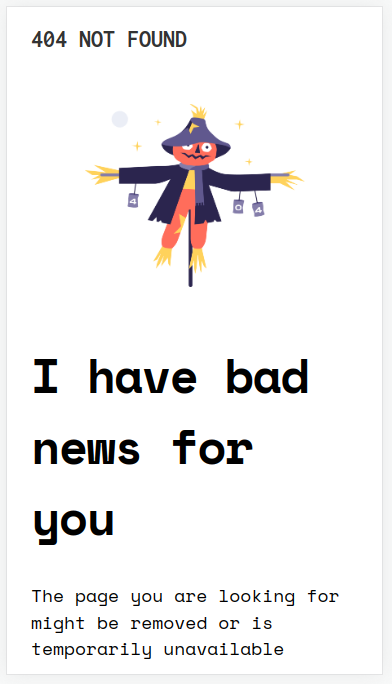
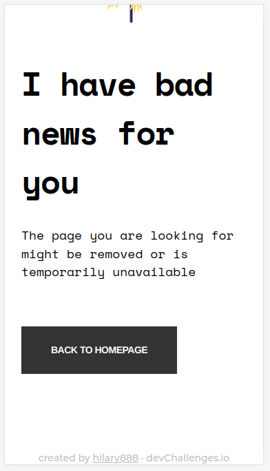

<h1 align="center">{404-not-found}</h1>

   Solution for a challenge from  <a href="http://devchallenges.io" target="_blank">Devchallenges.io</a>.

  <h3>
    <a href="https://hilary888.github.io/404-not-found/">
      Demo
    </a>
     | 
    <a href="https://github.com/hilary888/404-not-found">
      Solution
    </a>
     | 
    <a href="https://devchallenges.io/challenges/wBunSb7FPrIepJZAg0sY">
      Challenge
    </a>
  </h3>

## Table of Contents

- [Table of Contents](#table-of-contents)
- [Overview](#overview)
  - [Screenshots](#screenshots)
  - [Built With](#built-with)

## Overview
### Screenshots
Desktop and Mobile Screenshots

### Built With

- HTML
- CSS
